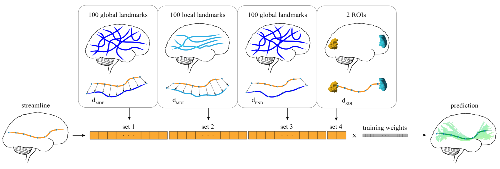

[](https://github.com/brain-life/abcd-spec)
[](https://doi.org/10.25663/brainlife.app.265)

# app-classifyber-segmentation
This App implements only the TEST PHASE of Classifyber, i.e. it runs Classifyber as a pre-trained bundle segmentation method. Classifyber is a supervised streamline-based method that performs automatic bundle segmentation based on binary linear classification, which simultaneously combines information from bundle geometries, connectivity patterns, and atlases. In addition, it is robust to a multitude of diverse settings, i.e. it can deal with different bundle sizes, tracking algorithms, and dMRI data qualities.



If you want to run both the TRAINING and TEST PHASES, please refer to the App https://doi.org/10.25663/brainlife.app.228.

### Authors
- Giulia Bertò (giulia.berto.4@gmail.com)

### Contributors
- Emanuele Olivetti (olivetti@fbk.eu)

### Funding Acknowledgement
brainlife.io is publicly funded and for the sustainability of the project it is helpful to Acknowledge the use of the platform. We kindly ask that you acknowledge the funding below in your publications and code reusing this code.

[](https://nsf.gov/awardsearch/showAward?AWD_ID=1734853)
[](https://nsf.gov/awardsearch/showAward?AWD_ID=1636893)
[](https://nsf.gov/awardsearch/showAward?AWD_ID=1916518)
[](https://nsf.gov/awardsearch/showAward?AWD_ID=1912270)
[](https://grantome.com/grant/NIH/R01-EB029272-01)

### Citation
We kindly ask that you cite the following article when publishing papers and code using this code: 
1. ["Classifyber, a robust streamline-based linear classifier for white matter bundle segmentation"](https://doi.org/10.1016/j.neuroimage.2020.117402), Bertò, G., Bullock, D., Astolfi, P., Hayashi, S., Zigiotto, L., Annicchiarico, L., Corsini, F., De Benedictis, A., Sarubbo, S., Pestilli, F., Avesani, P., Olivetti, E. NeuroImage (2020).
2. Avesani, P., McPherson, B., Hayashi, S. et al. The open diffusion data derivatives, brain data upcycling via integrated publishing of derivatives and reproducible open cloud services. Sci Data 6, 69 (2019). [https://doi.org/10.1038/s41597-019-0073-y](https://doi.org/10.1038/s41597-019-0073-y)

## Running the app
### On [Brainlife.io](http://brainlife.io/) 
You can submit this App online at https://doi.org/10.25663/brainlife.app.265 via the “Execute” tab.

#### Branch 1.0:
Inputs: \
You only need to provide the tractogram of the (target) subject you want to extract the bundle(s) from and the anatomical T1 of the (target) subject. WARNING: the tractogram needs to be already co-registered in the MNI152 T1 space (you can use the App https://doi.org/10.25663/brainlife.app.202 to warp your .tck file to the correct anatomical space).

Output: \
You will get the wmc segmentation of the bundle(s) of interest in the target subject. You can convert it in multiple .tck files with the App https://doi.org/10.25663/brainlife.app.251.

You can choose the bundle(s) to be segmented by providing the id(s) related to the training results you want to use as follows: 

HCP-IFOF (WARNING: it might be uneffective if the input tractogram has not ~500K streamlines): \
32 - Left IFOF \
33 - Right IFOF

HCP-minor (WARNING: it might be uneffective if the input tractogram has not ~500K streamlines): \
38 - Left pArc \
39 - Right pArc \
40 - Left TP-SPL \
41 - Right TP-SPL \
42 - Left MdLF-SPL \
43 - Right MdLF-SPL \
44 - Left MdLF-Ang \
45 - Right MdLF-Ang 

#### Branch 1.1:
Inputs: \
You only need to provide the tractogram of the (target) subject you want to extract the bundle(s) from and the anatomical T1 of the (target) subject (the two inputs should be in the same anatomical space). The tractogram will be then internally co-registered to the MNI152 T1 space.

Additional options with respect to branch 1.0:
- initial non-linear registration of the tractogram in the proper MNI152 T1 space
- the output segmented bundles are given also in tck format
- possibility to segment also bundles conforming those of the HCP-major and Clinical datasets as follows:

HCP-major (WARNING: it might be uneffective if the input tractogram has <5M streamlines): \
21 - Left CST \
22 - Right CST \
23 - Left IFOF \
24 - Right IFOF \
25 - Left ILF \
26 - Right ILF \
27 - Left UF \
28 - Right UF \
29 - Left AF \
30 - Right AF

Clinical: (WARNING: it might be uneffective if the input tractogram has >300K streamlines) \
35 - Left IFOF \
36 - Left AF 

#### Branch 1.2:
As branch 1.1 with some small enhancements.

#### Branch 1.3:
As branch 1.2, but running with python3.

### Running locally
1. git clone this repo.
2. Inside the cloned directory, create `config.json` with something like the following content with paths to your input files:
```
{
  "tractogram_static": "./track.tck",
  "t1_static": "./t1.nii.gz",
  "tractID_list": "32, 33, 40, 45"
}
```
3. Launch the App by executing `main`.
```
./main
```

### Output
The output is a wmc file containing the specified bundles segmented by Classifyber. The same output is also given as bundles in .tck format.

#### Dependencies
This App only requires [singularity](https://sylabs.io/singularity/) to run.

#### MIT Copyright (c) 2020 Bruno Kessler Foundation (FBK)
